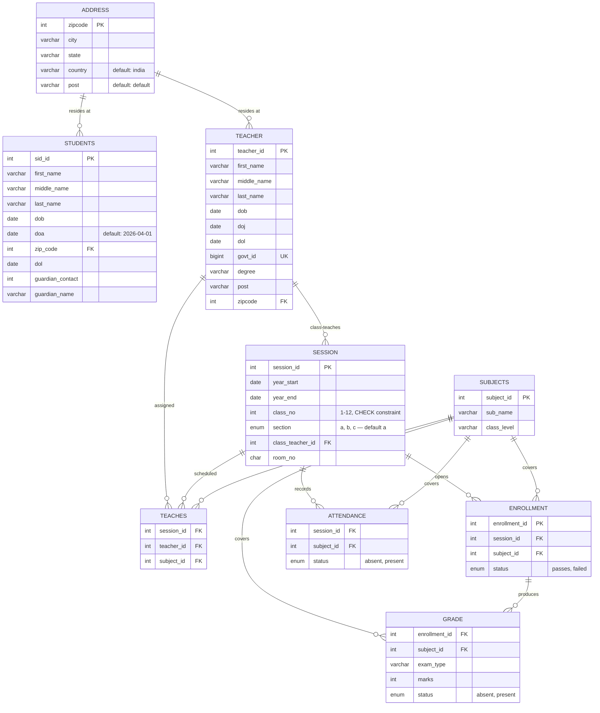

# EduTrack — Relational Database for a School Management System

A normalized MySQL 8.0 database schema designed to manage the core academic and administrative operations of a school: student records, teacher assignments, class sessions, subject enrollment, attendance, and grading.

---

## Overview

EduTrack models a school as a set of interrelated entities rather than flat, redundant tables. A **session** (e.g. "Class 8, Section A, 2025–26") sits at the center of the schema — it ties together which teacher leads the class, which subjects are taught in it, which students are enrolled, and how attendance and grades are recorded against it.

The schema is built around three logical clusters:

- **People & Location** — `students`, `teacher`, `address`
- **Academic Structure** — `session`, `subjects`, `enrollment`, `teaches`
- **Performance Tracking** — `grade`, `attendance`

---

## ER Diagram



---

## Entity Descriptions

| Table | Purpose |
|---|---|
| `address` | Master list of zipcodes with city/state/country, referenced by both students and teachers |
| `students` | Student personal records, admission/leaving dates, guardian contact info |
| `teacher` | Teacher personal records, government ID, degree, joining/leaving dates |
| `session` | A specific class-section-year offering (e.g. Class 8-A, 2025–26), with an assigned class teacher and room |
| `subjects` | Catalog of subjects, tagged with the class level they belong to |
| `teaches` | Junction table resolving which teacher teaches which subject in which session (many-to-many) |
| `enrollment` | Links a session to a subject as an "offering" students can be graded against |
| `grade` | Exam marks per enrollment/subject/exam type |
| `attendance` | Present/absent record per session/subject |

---

## Key Design Decisions

- **Normalization**: Address data is factored out into its own table instead of being duplicated across `students` and `teacher`.
- **Composite uniqueness**: `session` enforces one row per `(year_start, year_end, class_no, section)` combination via a unique key, preventing duplicate class offerings.
- **Data validation at the DB layer**: A `CHECK` constraint restricts `session.class_no` to the range 1–12.
- **Many-to-many resolution**: `teaches` (teacher ↔ subject ↔ session) and `enrollment` (session ↔ subject) are proper junction tables rather than repeating-group hacks.
- **Referential integrity**: 9 foreign key constraints tie the schema together, with `ON DELETE`/`ON UPDATE` left at MySQL defaults (`RESTRICT`).

---

## Known Data Issues (from the sample dump)

These are worth being aware of if you extend or present this project:

- `teacher.govt_id` is declared `UNIQUE`, but the sample data contains a likely typo (`2280685775789` vs `22806857897789` — differing digit counts for what appear to be the same ID format).
- Several rows in `students` are exact duplicates aside from `sid_id` (e.g. rows sharing identical name, DOB, and guardian data) — there's currently no constraint preventing duplicate student records.
- `session`, `subjects`, `enrollment`, `grade`, `attendance`, and `teaches` are empty in the seed dump; only `address`, `students`, and `teacher` are populated.

---

## Tech Stack

- **Database**: MySQL 8.0.40
- **Charset**: `utf8mb4` / `utf8mb4_0900_ai_ci`
- **Storage Engine**: InnoDB

---

## Setup

```bash
mysql -u root -p < dump.sql
```

This creates the `aryan` schema (or your target database) with all tables and the seed data included in the dump.

---

## Resume Bullet Points

- Designed and implemented a normalized MySQL 8.0 relational database (EduTrack) for a school management system, modeling 9 interrelated entities including students, teachers, sessions, attendance, and grades
- Built a 3NF schema resolving multiple many-to-many relationships (teacher–subject–session, session–subject) via junction tables (`teaches`, `enrollment`), reducing data redundancy
- Enforced data integrity using composite unique keys, `CHECK` constraints, and 9 foreign key relationships across the schema
- Modeled academic workflows including attendance tracking, grade/exam management, and student-teacher assignment by session and subject
